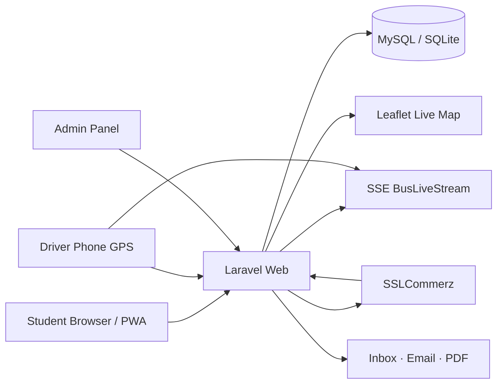

<p align="center">
  <strong>Laravel</strong> · <strong>Leaflet</strong> · <strong>PWA</strong> · <strong>SSLCommerz</strong> · <strong>Firebase</strong>
</p>

<p align="center">
  <a href="https://studentmove-app-d866.onrender.com"><strong>Live app</strong></a>
  ·
  <a href="#quick-start">Quick start</a>
  ·
  <a href="#features">Features</a>
  ·
  <a href="#architecture">Architecture</a>
  ·
  <a href="#demo-access">Demo access</a>
  ·
  <a href="#team">Team</a>
</p>

---

# StudentMove

**Smart transport for Dhaka students — live buses, route intelligence, student passes, and driver GPS in one web app.**

Built for **Daffodil International University** · Software Engineering · **Md. Shadman Hasin & Md. Shadman Tahsin**

| | |
|---|---|
| **Live** | **[https://studentmove-app-d866.onrender.com](https://studentmove-app-d866.onrender.com)** |
| **Stack** | Laravel 9 · Blade · Tailwind · MySQL / SQLite · Leaflet |
| **Payments** | SSLCommerz (bKash · Nagad · cards) |
| **Auth** | Google sign-in · email registration · profile completion gate |

---

## Why this exists

Dhaka commutes are unpredictable — crowded buses, shifting ETAs, and no single place to track campus routes, book a seat, or pay for a pass.

**StudentMove** puts that in one student-first platform: a live map fed by driver GPS, AI route help, subscription checkout, admin tools, and a driver panel that publishes location to riders in real time.

| **For students** | Book rides, track buses, buy passes, chat with AI or support |
| **For drivers** | Log in, ping GPS, update bus status from the phone |
| **For admins** | Manage routes, announcements, feedback, and manual GPS override |

---

## Quick start

### 1. Requirements

- PHP 8.0+
- Composer
- Node.js 18+ & npm
- MySQL (local) or SQLite (Docker / Render)

### 2. Clone & run locally

```bash
git clone https://github.com/Tahis-Fzs/StudentMove-Smart-Transport-Solution-for-Dhaka.git
cd StudentMove-Smart-Transport-Solution-for-Dhaka

cp .env.example .env
composer install
npm install && npm run build
php artisan key:generate
php artisan migrate --seed
php artisan serve
```

Open **http://127.0.0.1:8000**

### 3. Try the live app

**[https://studentmove-app-d866.onrender.com](https://studentmove-app-d866.onrender.com)**

Free Render tier may cold-start (~30s) after idle — reload once if the first load is slow.

### 4. First-time sign-in flow

```
/login  →  Continue with Google  →  complete student profile  →  dashboard
/register  →  full email + student ID path (alternative)
```

Google creates your account automatically; you add student ID, phone, and university on the next screen before the full app unlocks.

---

## Features

| Student app | Admin & driver |
|---|---|
| Live bus map (Leaflet + SSE stream) | Bus / route CRUD with run days & university tags |
| Next-bus cards, day tabs, delay toasts | GPS manual override + live stream publish |
| Route suggestions & saved favorites | Targeted announcements → user inbox |
| Ride booking with seat counts | Feedback manager (reply · archive) |
| Weekly / monthly / single passes | Support chat inbox |
| SSLCommerz checkout + PDF invoices | Reports, user management, activity logs |
| AI assistant + support chat (persisted) | Driver login & GPS dashboard |
| PWA — installable, offline shell | Delay alerts to booked riders |

### Main routes

```
/                     Landing
/login                Sign in or create account (Google first)
/register             Email signup with student verification
/dashboard            Student home (after profile complete)
/next-bus-arrival     Live map + schedules
/route-suggestion     Smart route finder
/bookings             Trip booking
/subscription         Pass checkout (SSLCommerz)
/chat                 AI + support chat
/driver/login         Driver GPS panel
/admin/login          Admin dashboard
```

---

## Architecture



### Real-time GPS flow

1. Driver (or admin) updates lat/lng → saved on `bus_schedules`
2. `BusLiveStream` publishes snapshot to cache
3. Map clients subscribe via **Server-Sent Events** (`/api/bus/stream/{id}`)
4. ETA / delay logic polls `/api/bus/get-location/{id}` as fallback

---

## Demo access

| Role | URL | Notes |
|------|-----|-------|
| **Student** | `/login` | Google sign-in or email registration |
| **Admin** | `/admin/login` | Set `ADMIN_PASSWORD` in Render Environment |
| **Driver** | `/driver/login` | Bus **BUS-001** · demo PIN in seeded data |
| **Payments** | `/subscription` | SSLCommerz sandbox on Render (`testbox` / `qwerty`) |

Never commit real admin passwords or payment credentials — use host environment secrets only.

---

## Repository map

| Path | Role |
|------|------|
| `routes/web.php` | Student, admin, driver, and API routes |
| `app/Http/Middleware/EnsureStudentProfileComplete.php` | Profile gate after Google sign-in |
| `app/Services/` | AI, SSLCommerz, Firebase, academic catalog |
| `resources/views/` | Blade UI (landing, map, auth, admin) |
| `public/css/` · `resources/js/` | Leaflet bundle, Firebase auth, PWA |
| `render.yaml` | Render Blueprint (Docker, env defaults) |
| `Dockerfile` | Production container |
| `scripts/live-smoke-test.sh` | Public route smoke checks |
| `tests/Feature/` | PHPUnit feature tests |

See [README_IMPLEMENTATION.md](README_IMPLEMENTATION.md) for subscription / payment notes.

---

## Functional requirements map

| Module | Owner | FR range |
|---|---|---|
| Authentication & student profiles | Md. Shadman Hasin | FR-1 – FR-8 |
| Routes, live tracking & maps | Md. Shadman Tahsin | FR-9 – FR-17 |
| Subscriptions, payments & admin tools | Md. Shadman Tahsin | FR-18 – FR-25, FR-36 – FR-45 |
| Notifications & feedback | Md. Shadman Hasin | FR-26 – FR-29, FR-32 – FR-35 |

> FR-30 and FR-31 are removed from scope.

---

## Troubleshooting

| Problem | Fix |
|---|---|
| Map tiles missing | Hard-refresh; check `/css/leaflet-bundle.css` loads |
| SSLCommerz not redirecting | Run `php artisan sslcommerz:check --probe`; set store creds in `.env` |
| Live stream idle | SSE keeps a long connection — driver must ping GPS |
| Render cold start | Wait ~30s on free tier, then reload |
| Google login on Render | Add `studentmove-app-d866.onrender.com` to Firebase **Authorized domains** |
| Skipped profile setup | Complete phone, student ID, and university at `/profile?complete=1` |
| Email issues locally | `php artisan email:diagnose` · check `storage/logs/laravel.log` |

---

## Team

**Daffodil International University** · Software Engineering

| Member | ID |
|---|---|
| Md. Shadman Hasin | 0242220005101462 |
| Md. Shadman Tahsin | 0242220005101461 |

---

## License

Educational project for **Software Engineering / Smart Transport** coursework.  
Fork it, extend it, deploy it — cite the team if you share it publicly.

<p align="center"><sub>Built for students who move Dhaka — not against traffic.</sub></p>
