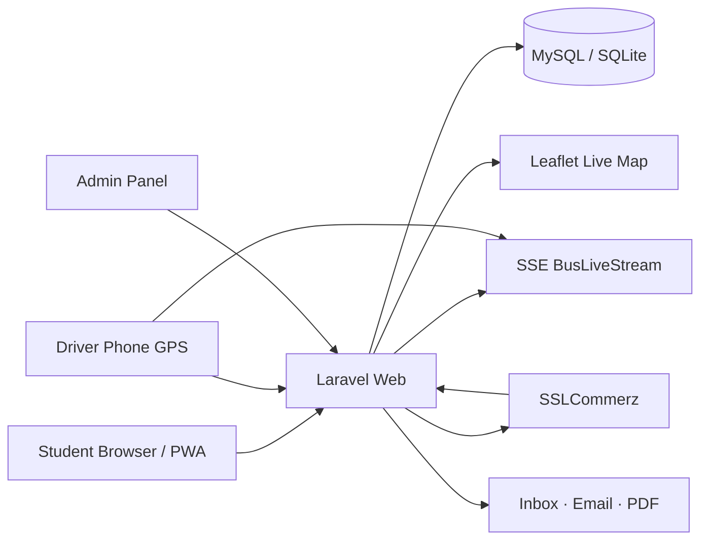

<p align="center">
  <strong>StudentMove</strong> · Laravel · Leaflet · PWA · SSLCommerz · Firebase
</p>

<p align="center">
  <a href="https://studentmove-app-d866.onrender.com"><strong>Live Demo</strong></a>
  ·
  <a href="#quick-start">Quick Start</a>
  ·
  <a href="#features">Features</a>
  ·
  <a href="#architecture">Architecture</a>
  ·
  <a href="#tech-stack">Tech Stack</a>
  ·
  <a href="#team">Team</a>
</p>

---

# StudentMove

**Smart transport for Dhaka students — live buses, route suggestions, passes, and driver GPS in one web app.**

Built for **Daffodil International University** · Software Engineering project · 5-module full-stack team

| | |
|---|---|
| **Live app** | [https://studentmove-app-d866.onrender.com](https://studentmove-app-d866.onrender.com) *(stable — Render)* |
| **Stack** | Laravel 9 · Blade · Tailwind · MySQL/SQLite · Leaflet |
| **Payments** | SSLCommerz (bKash · Nagad · cards) |

---

## Why this exists

Dhaka commutes are unpredictable — crowded buses, shifting ETAs, and no single place to track campus routes, book a seat, or pay for a pass.

**StudentMove** brings that into one student-first platform: a live map with driver GPS, AI route help, subscription checkout, admin tools, and a driver panel that feeds real-time location to riders.

| **For students** | Book rides, track buses, buy passes, chat with AI or support |
| **For drivers** | Log in, ping GPS, update bus status from the phone |
| **For admins** | Manage routes, announcements, feedback, and manual GPS override |

---

## Quick start

### 1. Requirements

- PHP 8.0+
- Composer
- Node.js 18+ & npm
- MySQL (local) or SQLite (Docker / Render)

### 2. Clone & install

```bash
git clone https://github.com/Tahis-Fzs/StudentMove-Smart-Transport-Solution-for-Dhaka.git
cd StudentMove-Smart-Transport-Solution-for-Dhaka

cp .env.example .env
composer install
npm install && npm run build
php artisan key:generate
php artisan migrate --seed
php artisan serve
```

Open **http://127.0.0.1:8000**

### 3. Optional: SSLCommerz sandbox

```bash
# .env — defaults in .env.example (testbox / qwerty)
php artisan sslcommerz:check --probe
```

Then visit `/subscription` and checkout via the sandbox gateway.

### 4. Try the live demo

**[https://studentmove-app-d866.onrender.com](https://studentmove-app-d866.onrender.com)** — permanent Render URL (free tier may cold-start ~30s after idle).

#### Live demo credentials (Render)

| Role | URL | Credentials |
|------|-----|-------------|
| **Student** | `/register` or Google sign-in | Create an account or use Google |
| **Admin** | `/admin/login` | Password: `StudentMove@Admin2026` |
| **Driver** | `/driver/login` | Password: `driver123` · Bus: **BUS-001** |
| **Payments** | `/subscription` | SSLCommerz sandbox (`testbox` / `qwerty`) |

> Add these on Render **Environment** if not already set: `ADMIN_PASSWORD`, `SSLCOMMERZ_*`, and your Firebase `FIREBASE_*` keys.

> Use a Cloudflare tunnel only for **local dev demos** — `trycloudflare.com` URLs change when the tunnel restarts.

---

## Features

| Student app | Admin & driver |
|---|---|
| Live bus map (Leaflet + SSE stream) | Bus / route CRUD with run days & university tags |
| Next-bus cards, day tabs, delay toasts | GPS manual override + live stream publish |
| Route suggestions & saved favorites | Targeted announcements → user inbox |
| Ride booking with seat counts | Feedback manager (reply · archive) |
| Weekly / monthly / single passes | Support chat inbox |
| SSLCommerz checkout + PDF invoices | Reports, user management, activity logs |
| AI assistant + support chat (persisted) | Driver login & GPS dashboard |
| PWA — installable, offline shell | Delay alerts to booked riders |

### Main routes

```
/                     Landing
/dashboard            Student home
/next-bus-arrival     Live map + schedules
/route-suggestion     Smart route finder
/bookings             Trip booking
/subscription         Pass checkout (SSLCommerz)
/chat                 AI + support chat
/feedback             Submit & view replies
/driver/login         Driver GPS panel
/admin/login          Admin dashboard
```

---

## Architecture



### Real-time GPS flow

1. Driver (or admin) updates lat/lng → saved on `bus_schedules`
2. `BusLiveStream` publishes snapshot to cache
3. Map clients subscribe via **Server-Sent Events** (`/api/bus/stream/{id}`)
4. ETA / delay logic polls `/api/bus/get-location/{id}` as fallback

---

## Tech stack

| Layer | Tools |
|---|---|
| **Backend** | Laravel 9, PHP 8+, Sanctum |
| **Frontend** | Blade, Tailwind CSS, Vite, Leaflet 1.9 |
| **Database** | MySQL (dev) · SQLite (Render Docker) |
| **Auth** | Laravel Breeze + Firebase social login |
| **Payments** | SSLCommerz hosted checkout |
| **PDF** | DomPDF (invoices) |
| **AI** | OpenRouter-compatible API (optional) |
| **Deploy** | Docker · [Render](https://render.com) (`render.yaml`) |

---

## Functional requirements map

| Module | Owner | FR range |
|---|---|---|
| Authentication | Md. Shadman Hasin | FR-1 – FR-8 |
| Routes & live tracking | Md. Shadman Tahsin | FR-9 – FR-17 |
| Subscription & payment | Md. Julfikar Hasan | FR-18 – FR-25 |
| Notifications & feedback | Nahid Hasan | FR-26 – FR-29, FR-32 – FR-35 |
| Admin & driver app | KM Najimuddin | FR-36 – FR-45 |

> FR-30 and FR-31 are removed from scope.

See [README_IMPLEMENTATION.md](README_IMPLEMENTATION.md) for subscription / payment implementation notes.

---

## Troubleshooting

| Problem | Fix |
|---|---|
| Map tiles missing | Hard-refresh; check `/css/leaflet-bundle.css` loads |
| SSLCommerz not redirecting | Run `php artisan sslcommerz:check --probe`; set store creds in `.env` |
| Live stream idle | SSE opens a long connection — normal; driver must ping GPS |
| Render cold start | Wait ~30s on free tier, then reload |
| Google login on Render | Add `studentmove-app-d866.onrender.com` to Firebase **Authorized domains** |
| Cloudflare tunnel (local) | Temporary URL only — not for README / production |
| Migrations fail | `php artisan migrate:fresh --seed` on a clean DB |

---

## Team

**Daffodil International University** · Software Engineering

| Member | ID |
|---|---|
| Md. Shadman Hasin | 0242220005101462 |
| Md. Shadman Tahsin | 0242220005101461 |
| Md. Julfikar Hasan | 0242220005101495 |
| Nahid Hasan | 0242220005101460 |
| KM Najimuddin | 0242220005101493 |

---

## License

Educational project for **Software Engineering / Smart Transport** coursework.  
Use it, extend it, deploy it — just cite the team if you fork it publicly.

<p align="center"><sub>Built for students who move Dhaka — not against traffic.</sub></p>
